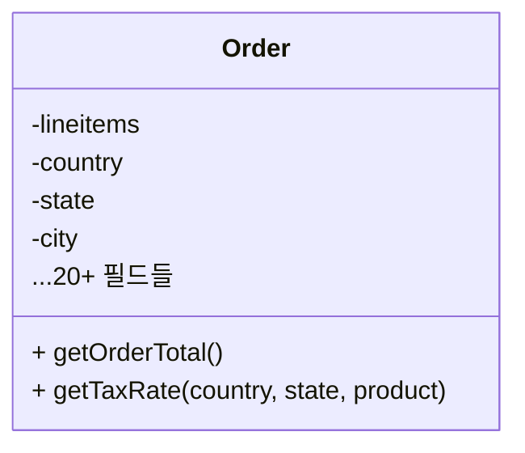
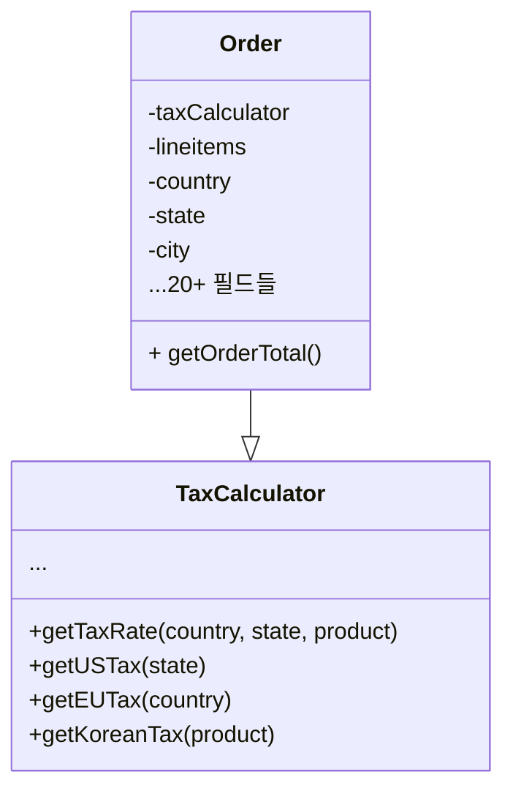

# 디자인 원칙들

**좋은 소프트웨어 디자인이란?**
개발 중인 앱의 유형에 따라 다르지만 보편적인 몇가지 원칙들이 존재한다.

## 변화하는 내용 캡슐화

```md
당신의 앱에서 변경되는 부분들을 식별한 후 변하지 않는 부분들과 구분하세요.
```

- 이 원칙의 가장 큰 목적은 변화로 인해 발생하는 결과를 최소화하는 것.
- 변경되는 부분들을 떼어내면 변경되지 않는 나머지 부분들을 보호할 수 있다.
- 이로 인해 변경 사항들을 구현하고 테스트하는 데 걸리는 시간을 줄일 수 있다.

### 메서드 수준에서의 캡슐화

#### 전자 상거래 웹사이트 개발 예시

```javascript
method getOrderTotal(order) is total = 0
foreach item in order.lineItems
    total += item.price * item.quantity
if (order.country == "US")
total += total * 0.07 // US sales tax
else if (order.country == "EU"):
total += total * 0.20 // European VAT
return total
```

- 위 코드에서 세금을 포함한 주문의 총계를 계산하는 `getOrderTotal` 메서드가 있다.
- 만약 세법이나 세율이 바뀌어 세금 관련 공식을 수정해야 한다면 `getOrderTotal`이라는 메서드 자체를 자주 수정해야 한다.
- 해당 메서드는 세금이 계산되는 방법에는 아무 관심이 없다.
- => 세금 계산 로직을 별도의 메서드로 추출하여 캡슐화할 수 있다.

```javascript
method getOrderTotal(order) is total = 0
foreach item in order.lineItems
total += item.price * item.quantity total += total * getTaxRate(order.country) return total
method getTaxRate(country) is if (country == "US")
return 0.07 // US sales tax else if (country == "EU")
return 0.20 // European VAT else
return 0
```

### 클래스 수준에서의 캡슐화

- 시간이 흐르면서 간단한 작업을 수행했던 메서드에 점점 더 많은 책임이 추가될 수 있다.
- 그렇게 메서드가 커지면 이를 포함하는 클래스의 기본적인 책임을 모호하게 만든다.
  - 새로운 필드가 추가되거나 메서드가 추가될 수도 있다.
- 이 모든 것들을 새 클래스로 추출하면 코드가 훨씬 명확하고 간단해진다.

#### 변경 전 (세금 계산에 대한 로직이 Order 클래스 내부에 있음)



#### 변경 후 (세금 계산에 대한 로직이 Order 클래스로부터 숨겨짐)


