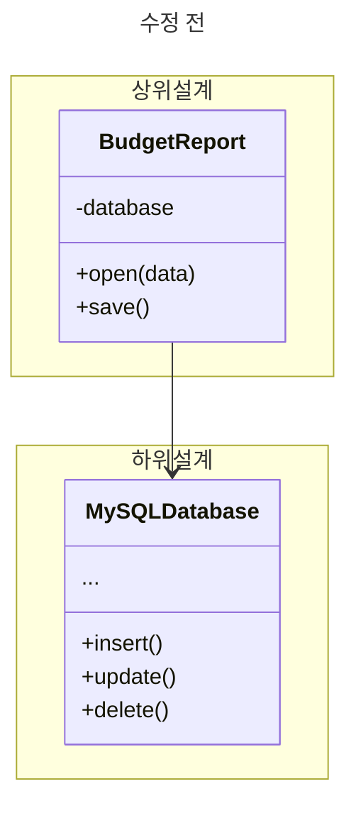
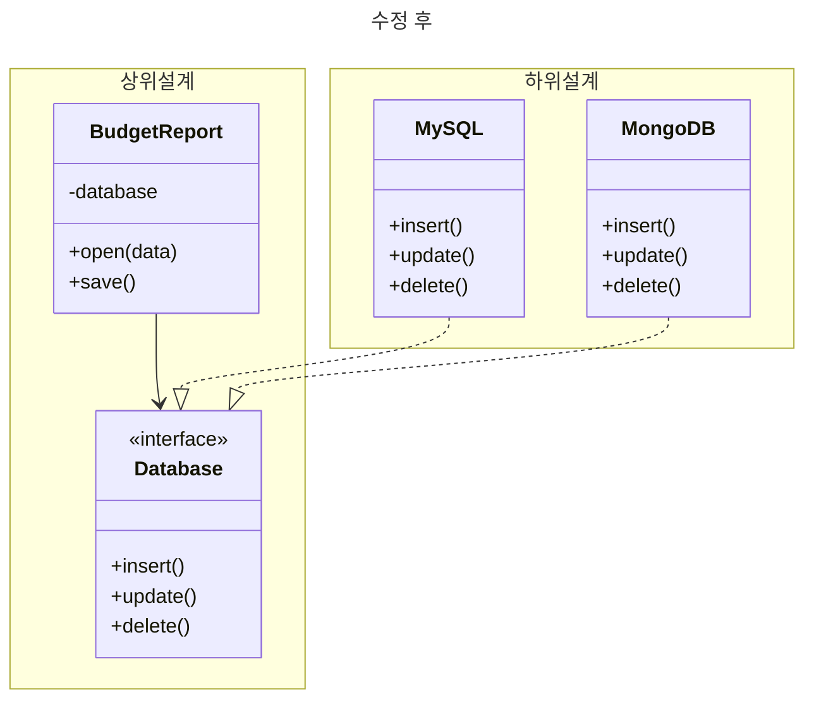

# 3-4 민순기

## 의존관계 역전 원칙 (Dependency Inversion Principle)

> 상위 계층 클래스들은 하위 계층 클래스들에 의존해서는 안된다.
> 둘 다 추상화에 의존해야 한다.
> 추상화는 세부 정보들에 의존해서는 안된다.
> 세부 정보들이 추상화들에 의존해야 한다.

일반적으로 소프트웨어를 디자인할 때 클래스를 다음 두 계층으로 분류할 수 있다.

- **하위 계층 클래스**
  - 디스크와의 작업, 네트워크를 통한 데이터 전송, DB 연결 등 기본 작업 구현
- **상위 계층 클래스**
  - 하위 계층 클래스들에 명령을 내리는 복잡한 비즈니스 로직

하위 계층 클래스들을 먼저 디자인한 다음 상위 클래스들을 디자인하는 경우가 있다.

새 시스템에서 프로토타입을 개발하기 시작하는 경우 일반적인데, 상위 계층에서 어떤 일을 할 수 있는지 확신할 수 없기 때문이다.

이러한 접근 방식을 사용하면 비즈니스 로직 클래스들이 하위 클래스들에 의존하는 경향이 있다.

의존관계 역전 원칙은 이러한 의존관계의 방향을 바꾸자고 제안한다.

1. 상위 계층 클래스가 의존하는 하위 계층 작업의 인터페이스를 설명할 때 되도록 비즈니스 용어를 사용해야 한다.

   - 책 예시 : 비즈니스 로직에서는 `openFile()`, `readBytes()`등의 하위 계층 메서드를 호출하는 대신 `openReport(file)` 같은 메서드를 호출해야 한다.
   - 다른 예시 : `axios.get()` 대신 `getUserInformation(userId)` 사용

2. 이제 상위 계층 클래스들을 만들 때 이러한 인터페이스에 의존하도록 만들 수 있다.

   - 하위 계층에 의존하는것이 아니다.
   - 이 의존관계는 원래의 의존관계보다 의존성이 훨씬 약할것이다.

3. 하위 계층 클래스들이 이러한 인터페이스들을 구현하면 비즈니스 로직 계층에 의존하게 되어 원래 의존관계의 방향이 역전된다.

의존관계 역전 원칙은 종종 `계방/폐쇄 원칙`과 함께 진행된다.
하위 계층 클래스를 확장하여 기존의 클래스들을 손상하지 않고 다른 비즈니스 로직 클래스들과 함께 사용할 수 있다.

### 예시

이 예시에서 `BudgetReport`클래스는 데이터를 읽고 수정하기 위해 하위 계층 `Database` 클래스를 사용한다.
이는 하위 계층 클래스인 `Database` 클래스의 변경이 상위 클래스인 `BudgetReport`클래스에 영향을 미친다는 것을 의미한다.

---

다음 절차를 거쳐 이 문제를 해결할 수 있다.

1. 상위 계층에 읽기, 쓰기 작업을 설명하는 인터페이스를 생성한다.
2. `BudgetReport` 클래스는 이 인터페이스를 사용한다.
3. 하위 계층 클래스가 상위 계층 클래스에 선언된 읽기, 쓰기 인터페이스를 구현한다.

의존관계가 역전되어 이제 하위 계층의 클래스가 상위 계층의 추상화에 의존한다.
