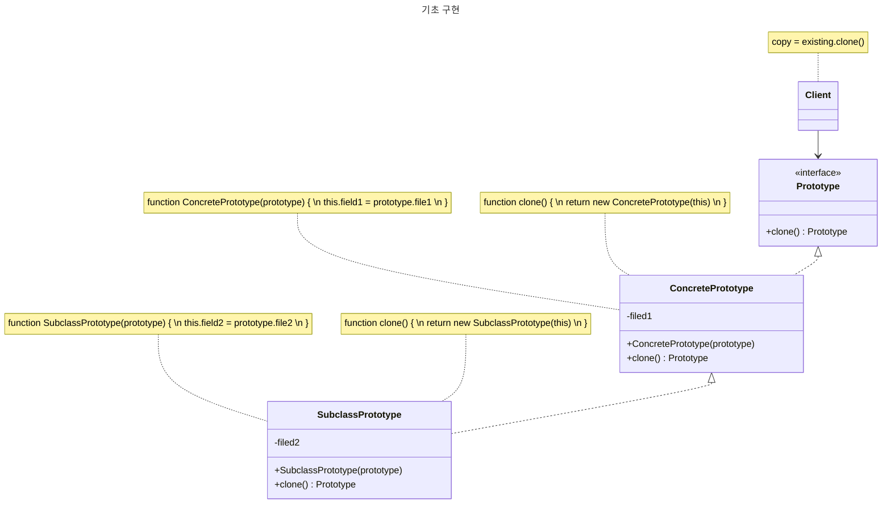

# 프로토타입 패턴

> **프로토타입**은 코드를 그들의 클래스들에 의존시키지 않고 기존 객체들을 복사할 수 있도록 하는 생성 디자인 패턴입니다.

## 문제

> 객체가 있고 그 객체의 정확한 복사본을 만들고 싶다면?

**방법.** 같은 클래스의 새 객체를 생성한 후 원본 객체의 모든 값들을 새 객체에 복사한다.

- **문제1.** 필드중 일부가 `private`이라면?
  - 외부에서 접근이 불가능하기 때문에 복사가 불가능하다.
- **문제2.** 객체의 복제본을 생성하려면 해당 객체의 클래스를 알아야 한다.
  - 해당 클래스에 의존하게 된다.
- **문제3.** 메서드의 매개변수가 추상 클래스를 구현한 객체일때
  - 해당 객체의 구상 클래스를 알지 못할 수 있다.

## 해결책 (프로토타입 패턴)

> 프로토타입 패턴은 실제로 복제되는 객체들에 복제 프로세스를 위임한다.

- 패턴은 복제를 지원하는 모든 객체에 대한 공통 인터페이스를 선언한다.
- 이 인터페이스를 사용하면 코드를 특정 클래스에 의존하지 않고 객체를 복제할 수 있다.
- 일반적으로 이 인터페이스에는 단일 `clone` 메서드만 포함된다.

<br />

> `clone` 메서드의 구현은 모든 클래스에서 매우 유사하다.

- `clone` 메서드는 현재 클래스의 객체를 만든 후 이전 객체의 모든 필드값을 새 객체로 전달한다.
- 대부분의 언어는 같은 클래스에 속한 다른 객체의 `private` 필드들에 접근할 수 있으므로 비공개 필드들을 복사하는 것도 가능하다.

<br />

> 복사를 지원하는 객체를 **프로토타입**이라고 한다.

- 객체 내에 수없이 많은 필드와 설정이 있을 경우 이를 복제하는 것이 서브클래싱의 대안이 될 수 있다.

<details>
    <summary style="cursor:pointer;">
        <b>서브클래싱이란?</b>
    </summary>
    구현되어 있는 클래스를 상속하는 것
</details>

<br />

## 구조



### 1. 프로토타입

- **Prototype** 인터페이스(혹은 추상 클래스)는 일반적으로 `clone` 메서드를 정의한다.

### 2. 구상 프로토타입

- `clone` 메서드를 구현한다.

### 3. 클라이언트

- 프로토타입 인터페이스를 사용하여 객체를 복제한다.

### 프로토타입 레지스트리

- **프로토타입 레지스트리**는 자주 사용하는 프로토타입에 쉽게 접근하는 방법을 제공한다.
- 프로토타입 레지스트리는 다양한 프로토타입 인스턴스를 저장하고, 클라이언트가 필요할 때 해당 인스턴스를 복제하여 사용할 수 있도록 한다.
- 객체 생성의 복잡성을 줄이고, 동일한 프로토타입을 여러 번 사용할 수 있도록 한다.

```typescript
interface Prototype {
  clone(): Prototype;
}

class PrototypeRegistry {
  private registry: { [key: string]: Prototype } = {};

  addPrototype(key: string, prototype: Prototype): void {
    this.registry[key] = prototype;
  }

  getPrototype(key: string): Prototype | null {
    const prototype = this.registry[key];
    return prototype ? prototype.clone() : null;
  }
}

class ConcretePrototype implements Prototype {
  private field1: string;

  constructor(field1: string) {
    this.field1 = field1;
  }

  clone(): Prototype {
    return new ConcretePrototype(this.field1);
  }

  getField1(): string {
    return this.field1;
  }
}

class Client {
  public static main(): void {
    const registry = new PrototypeRegistry();
    const prototype1 = new ConcretePrototype("example1");
    registry.addPrototype("proto1", prototype1);

    const clonedPrototype = registry.getPrototype("proto1");
    if (clonedPrototype instanceof ConcretePrototype) {
      console.log("Cloned Prototype: " + clonedPrototype.getField1());
    }
  }
}

Client.main();
```

## 프로토타입 패턴 예제

```typescript
type SourceWithoutClone<S> = Omit<S, "clone">;

// 기초 프로토타입
abstract class Shape {
  x?: number;
  y?: number;
  color?: string;

  // 프로토타입 생성자. 기존 객체의 값들로 새로운 객체가 초기화됩니다.
  constructor(source?: SourceWithoutClone<Shape>) {
    this.x = source?.x;
    this.y = source?.y;
    this.color = source?.color;
  }

  // 복제 작업은 Shape 자식 클래스 중 하나를 반환합니다.
  abstract clone(): Shape;
}

/**
 * 구상 프로토타입.
 * 복제 메서드는 현재 클래스의 생성자를 호출해 현재 객체를 생성자의 인수로 전달함으로써 한 번에 새로운 객체를 생성합니다.
 * 생성자에서 실제로 모든 것을 복사하게 되면 결과의 일관성이 유지됩니다.
 * 생성자가 새로운 객체가 완전히 완성되기 전까지 결과를 반환하지 않아서 어떤 객체도 일부분만 완성된 복제본을 참조할 수 없습니다.
 */
class Rectangle extends Shape {
  width?: number;
  height?: number;

  constructor(source?: SourceWithoutClone<Rectangle>) {
    super(source);
    this.width = source?.width;
    this.height = source?.height;
  }

  clone(): Shape {
    return new Rectangle(this);
  }
}

class Circle extends Shape {
  radius?: number;

  constructor(source?: SourceWithoutClone<Circle>) {
    super(source);
    this.radius = source?.radius;
  }

  clone(): Shape {
    return new Circle(this);
  }
}

class Application {
  shapes: Shape[] = [];

  constructor() {
    const circle = new Circle();
    circle.x = 10;
    circle.y = 10;
    circle.radius = 20;

    this.shapes.push(circle);

    const anotherCircle = circle.clone();
    this.shapes.push(anotherCircle);

    const rectangle = new Rectangle();
    rectangle.width = 10;
    rectangle.height = 20;

    this.shapes.push(rectangle);
  }

  public businessLogic() {
    const shapesCopy: Shape[] = [];

    this.shapes.forEach((shape) => {
      shapesCopy.push(shape);
    });
  }
}

const app = new Application();
app.businessLogic();
```

## 적용해야 하는 경우

### 1. 코드가 복사해야 하는 객체들의 구상 클래스들에 의존하면 안될때

- 클라이언트 코드가 객체의 구체적인 클래스에 의존하지 않고 객체를 생성하거나 복제해야 하는 경우.
- 외부 라이브러리나 타사 코드에서 전달된 객체와 상호작용해야 하는 경우. 이 경우, 객체의 구체적인 클래스가 무엇인지 모를 수 있다.

### 2. 각자의 객체를 초기화하는 방식만 다른 자식 클래스들의 수를 줄이고 싶을 때

- 객체의 생성 과정이 복잡하거나 비용이 많이 드는 경우, 복제 메서드를 사용하여 이러한 초기화 과정을 피할 수 있다.

## 구현 방법

### 1. 프로토타입 인터페이스 생성

- 프로토타입 인터페이스를 생성한 후 `clone` 메서드를 선언.
- 기존 계층 구조가 있는 경우, `clone` 메서드를 그 계층 구조의 모든 클래스들에 추가.

### 2. 생성자 정의

- 프로토타입 클래스는 이 클래스의 객체를 인수로 받아들이는 대체 생성자를 반드시 정의해야 한다.
- 또 생성자는 이 클래스에 정의된 모든 필드의 값들을 전달된 객체에서 새로 생성된 인스턴스로 복사해야 한다.
- 자식 클래스를 변경할 때에는 부모 생성자를 호출하여 부모 클래스가 부모 클래스의 비공개 필드들의 복제를 처리하도록 해야 한다.

> 만약 언어 자체가 메서드 오버로딩을 지원하지 않으면 별도의 프로토타입 생성자를 만들 수 없다.
> 따라서 객체의 데이터를 새로 생성된 복제본에 복사하는 작업은 `clone` 메서드 내에서 수행되어야 한다.

### 3. 복제 메서드 구현

- 복제 메서드는 `new` 연산자를 실행한다.
- 모든 클래스는 복제 메서드를 명시적으로 오버라이딩 한 후 `new` 연산자와 함께 자체 클래스 이름을 사용해야 한다.

### 4. 추가 옵션

- 자주 사용하는 프로토타입들의 카탈로그를 지정할 중앙 프로토타입 레지스트리를 생성할 수 있다.
- 레지스트리를 새 팩토리 클래스로 구현하거나 레지스트리를 기초 프로토타입 클래스에 프로토타입을 가져오기 위한 정적 메서드와 함께 넣을 수 있다.
- 이 정적 메서드는 클라이언트가 메서드에 전달하는 인자를 기반으로 프로토타입을 검사해야 한다.
- 적절한 프로토타입을 찾고 나면, 레지스트리는 이를 복제한 후 복사본을 클라이언트에 반환해야 한다.
- 마지막으로, 자식 클래스에서 생성자를 직접 호출하는 대신 레지스트리 팩토리 메서드에 대한 호출로 대체한다.

## 장단점

- **장** 객체들을 구상 클래스들에 결합하지 않고 복제할 수 있다.
- **장** 반복되는 초기화 코드를 제거한 후 미리 만들어진 프로토타입들을 복제하는 방법을 사용할 수 있다.
- **장** 복잡한 객체들을 더 쉽게 생성할 수 있다.
- **장** 복잡한 객체들에 대한 사전 설정들을 처리할 때 상속 대신 사용할 수 있다.
- **단** 순환 참조가 있는 복잡한 객체들을 복제하는 것은 매우 까다로울 수 있다.

## 다른 패턴과의 관계

- 많은 디자인 패턴들은 **팩토리 메서드**로 시작해 **추상 팩토리**, **프로토타입**, **빌더** 등의 패턴으로 발전해나간다.
- **추상 팩토리** 클래스들은 **팩토리 메서드**들의 집합을 기반으로 하는 경우가 많다.  
  하지만 이 대신 **프로토타입**을 사용하여 **추상 팩토리**의 구상 클래스들의 생성 메서드들을 구현할 수도 있다.
- **프로토타입**은 **커맨드** 패턴의 복사본들을 저장해야 할 때 도움이 될 수 있다.
- **데코레이터** 및 **복합체** 패턴을 많이 사용하는 구조에서는 **프로토타입**을 사용하면 종종 이득을 볼 수 있다.
- **프로토타입**은 상속을 기반으로 하지 않으므로 상속과 관련된 단점이 없다.
- **프로토타입**이 **메멘토** 패턴의 더 간단한 대안이 될 수 있다.
- **추상 팩토리들**, **빌더들**, **프로토타입들**은 모두 **싱글턴**으로 구현 가능하다.
