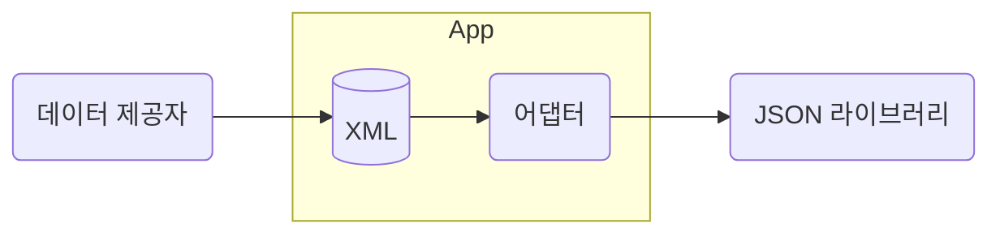
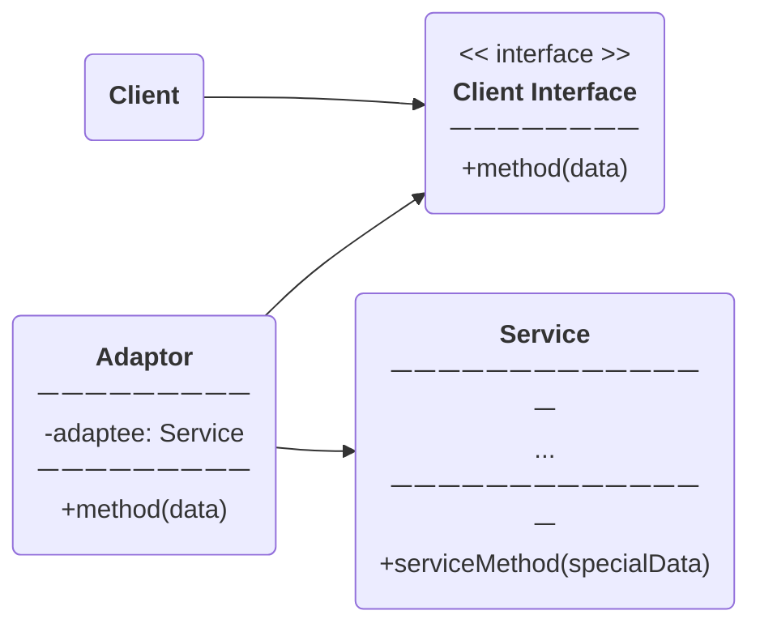
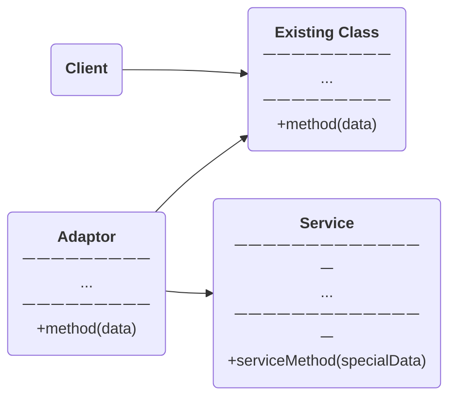

# 구조 패턴

> 구조 패턴은 구조를 유연하고 효율적으로 유지하면서 객체들과 클래스들을 더 큰 구조로 조립하는 방법을 설명한다.

## 구조 패턴의 종류

1. **어댑터**
   - 호환되지 않는 인터페이스를 가진 객체들이 협업할 수 있도록 한다.
2. **브리지**
   - 큰 클래스 또는 밀접하게 관련된 클래스들의 집합을 두 개의 계층구조로 나눈 후 각각 독립적으로 개발할 수 있도록 한다.
3. **복합체**
   - 객체들을 트리 구조들로 구성한 후, 트리 구조들이 개별 객체들인 것처럼 작업할 수 있도록 한다.
4. **데코레이터**
   - 객체들을 새로운 행동들을 포함한 특수 래퍼 객체들 내에 넣어서 위 행동들을 해당 객체들에 연결시킨다.
5. **퍼사드**
   - 라이브러리, 프레임워크, 다른 클래스들의 복잡한 집합들에 대한 단순화된 인터페이스를 제공한다.
6. **플라이웨이트**
   - 재사용 가능한 객체 인스턴스를 제공하여 메모리 사용량을 최소화한다.
7. **프록시**
   - 원본 객체를 대리하여 대신 처리하게 함으로써 로직의 흐름을 제어한다.

## 어댑터 패턴

> **어댑터**는 호환되지 않는 인터페이스를 가진 객체들이 협업할 수 있도록 하는 구조적 디자인 패턴이다.

### 문제 상황

#### 상황

1. 주식 데이터를 XML 형태로 다운로드 할 수 있도록 하는 앱을 개발중
2. 외부 라이브러리에서 JSON 형태로 주식 데이터를 가져오도록 설계

#### 문제

1. JSON과 XML이 호환되지 않기 때문에 있는 그대로 라이브러리를 사용할 수 없다.
2. 라이브러리에 접근이 불가능하다면 라이브러리 자체를 변경할 수도 없다.

### 해결책

1. XML 데이터를 JSON 데이터로 변환하는 어댑터 객체 생성
2. 혹은 JSON 데이터를 XML 데이터로 변환하는 어댑터 객체 생성
3. 어댑터를 통해서만 라이브러리와 통신하도록 구조를 조정



#### 구조

##### 객체 어댑터

- 이 구현은 객체 합성 원칙을 사용한다.
- 어댑터는 한 객체의 인터페이스를 구현하고 다른 객체는 래핑한다.



1. **클라이언트** : 프로그램의 기존 비즈니스 로직을 포함하는 클래스
2. **클라이언트 인터페이스** : 다른 클래스들이 클라이언트 코드와 통신할 수 있는 프로토콜
3. **서비스** : 타사 또는 레거시의 유용한 클래스. (직접 사용 X, 호환 X)
4. **어댑터** : 클라이언트와 서비스 양쪽에서 작동할 수 있는 클래스.
   어댑터 인터페이스를 통해 클라이언트 호출을 서비스 객체가 이해할 수 있는 형식으로 변환한다.
5. 클라이언트 코드는 클라이언트 인터페이스를 통해 어댑터와 작동하는 한 구상 어댑터 클래스와 결합하지 않는다.
   덕분에 기존 클라이언트 코드를 손상하지 않고 새로운 유형의 어댑터를 도입할 수 있다.

##### 클래스 어댑터

- 이 구현은 상속을 사용한다.
- 어댑터는 동시에 두 객체의 인터페이스를 상속한다.
- 이 방식은 다중 상속을 지원하는 프로그래밍 언어에서만 구현이 가능하다.



1. **클래스 어댑터**는 클라이언트와 서비스 양쪽에서 상속을 받기 때문에 객체를 래핑할 필요가 없다.

#### 예제 코드

```typescript
// WebRenderer 인터페이스
interface WebRenderer {
  render(content: string): void;
}

// WebRenderer 구현체
class WebRendererImpl implements WebRenderer {
  render(content: string): void {
    console.log(`Rendering on Web: ${content}`);
  }
}

// WebViewRenderer 인터페이스
interface WebViewRenderer {
  renderInWebView(content: string): void;
}

// WebViewRenderer 구현체
class WebViewRendererImpl implements WebViewRenderer {
  renderInWebView(content: string): void {
    console.log(`Rendering in WebView: ${content}`);
  }
}

// RendererAdapter 클래스: WebRenderer 인터페이스를 구현하지만 내부적으로 WebViewRenderer를 사용
class RendererAdapter implements WebRenderer {
  private webViewRenderer: WebViewRenderer;

  constructor(webViewRenderer: WebViewRenderer) {
    this.webViewRenderer = webViewRenderer;
  }

  render(content: string): void {
    this.webViewRenderer.renderInWebView(content);
  }
}

// 클라이언트 코드
const webRenderer: WebRenderer = new WebRendererImpl();
webRenderer.render("Hello from Web Renderer");

const webViewRenderer: WebViewRenderer = new WebViewRendererImpl();
const adapter: WebRenderer = new RendererAdapter(webViewRenderer);
adapter.render("Hello from WebView Renderer via Adapter");
```

1. `WebRenderer` 인터페이스와 `WebRendererImpl` 클래스는 웹 애플리케이션에서 사용하는 렌더러의 구현입니다.
2. `WebViewRenderer` 인터페이스와 `WebViewRendererImpl` 클래스는 모바일 애플리케이션에서 웹뷰를 사용해 렌더링하는 구현입니다.
3. `RendererAdapter` 클래스는 `WebRenderer` 인터페이스를 구현하면서 내부적으로 `WebViewRenderer` 객체를 사용합니다.
   이를 통해 `WebRenderer` 인터페이스를 기대하는 클라이언트 코드에서 `WebViewRenderer` 객체를 사용할 수 있게 해줍니다.
4. 클라이언트 코드에서는 `WebRenderer`와 `RendererAdapter`를 사용하여 각각의 렌더러를 출력합니다.

#### 언제 사용하나요?

1. 기존 클래스를 사용하고 싶지만 그 인터페이스가 나머지 코드와 호환되지 않을때 사용한다

2. 공통 기능들이 없는 기존 자식 클래스들을 재사용하려는 경우에 사용한다.

#### 구현 방법

사전 조건 : 호환되지 않는 인터페이스가 있는 클래스가 최소 두 개 이상 있는지 확인한다.

1. **클라이언트 인터페이스 정의**
   클라이언트 인터페이스를 정의하고 이 인터페이스를 통해 어댑터가 호환성을 제공하게 한다.

2. **서비스 클래스 정의**
   클라이언트 코드와 호환되지 않는 클래스. 이 클래스의 메서드를 어댑터를 통해 호출하게 한다.

3. **어댑터 클래스 정의**
   어댑터 클래스는 클라이언트 인터페이스를 구현하고, 기존 클래스의 객체를 내부에 포함하여
   클라이언트 인터페이스의 메서드를 호출할 때 서비스 클래스의 메서드를 호출한다.

4. **클라이언트 코드 작성**
   클라이언트 코드는 클라이언트 인터페이스를 통해 서비스 클래스의 기능을 사용할 수 있다.
   이를 통해 클라이언트 코드는 서비스 클래스의 구현에 의존하지 않으면서도 원하는 기능을 사용할 수 있다.

#### 장단점

##### 장점

1. **단일 책임 원칙**. 프로그램의 기본 비즈니스 로직에서 인터페이스 또는 데이터 변환 코드를 분리할 수 있다.
2. **개방 / 폐쇄 원칙**. 기존의 클라이언트 코드를 손상시키지 않고 새로운 어댑터를 도입할 수 있다.

##### 단점

1. 다수의 새로운 인터페이스와 클래스를 도입해야 하기 때문에 코드의 전반적인 복잡성이 증가한다.
