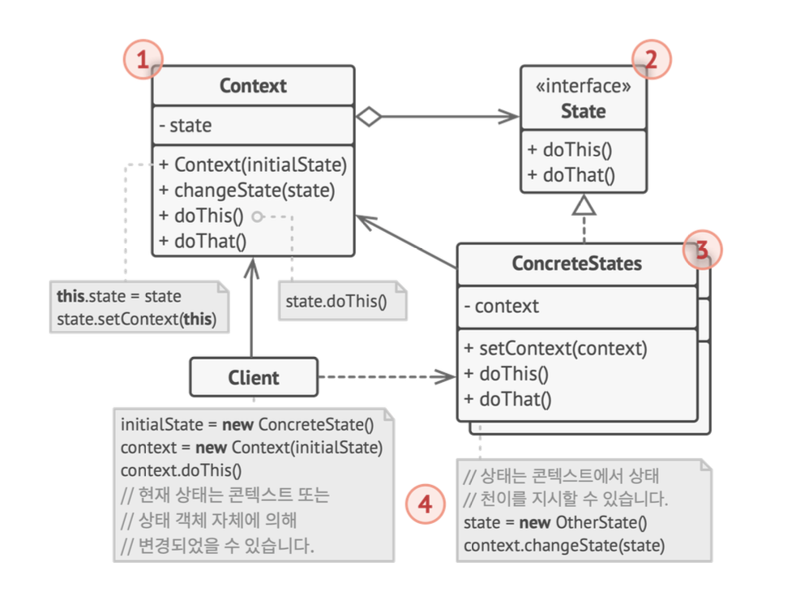
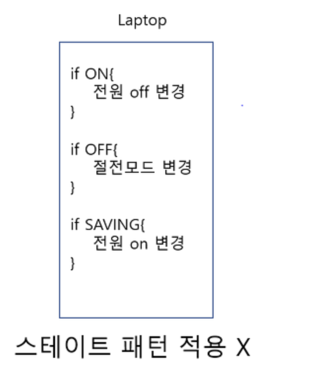
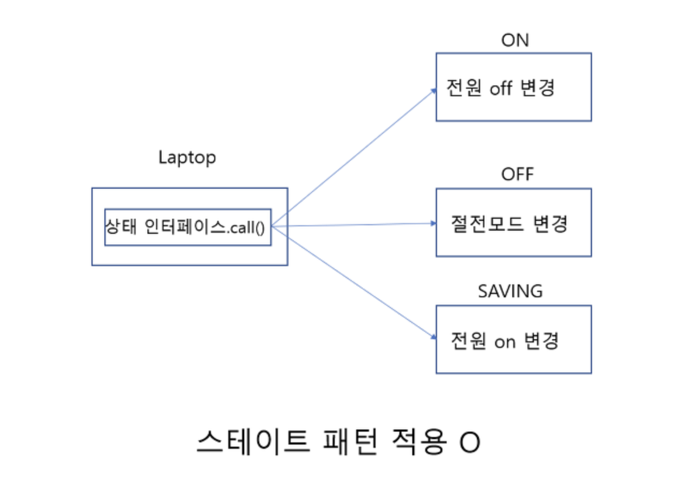

# 상태 패턴

> 상태 패턴은 객체가 특정 상태에 따라 다른 동작을 하는 상황에서,
> 자신이 직접 상태를 체크하여 상태에 따라 행위를 호출하지 않고,
> 상태를 객체화 하여 상태가 행동을 할 수 있도록 위임하는 패턴을 말합니다.
> **중요! React에서의 상태와는 다른 개념입니다**

## 문제 상황

- 상태 패턴은 **유한 상태 기계** 개념과 밀접하게 관련되어 있습니다.
<details>
    <summary style="cursor:pointer;">
        <b>유한 상태 기계?</b>
    </summary>
    <codeblock>유한 상태 기계는 유한한 개수의 상태를 가질 수 있는 오토마타, 즉 추상 기계라고 할 수 있다. 
    이러한 기계는 한 번에 오로지 하나의 상태만을 가지게 되며, 현재 상태(Current State)란 임의의 주어진 시간의 상태를 칭한다. 
    이러한 기계는 어떠한 사건(Event)에 의해 한 상태에서 다른 상태로 변화할 수 있으며, 이를 전이(Transition)이라 한다. 
    특정한 유한 오토마톤은 현재 상태로부터 가능한 전이 상태와, 이러한 전이를 유발하는 조건들의 집합으로서 정의된다.
    - 위키백과
    </codeblock>
</details>

- 상태 패턴의 주요 개념은 모든 주어진 순간에 프로그램이 속해 있을 수 있는 상태들의 수가 **유한**하다는 것입니다.
- 어떤 상태 안에서 프로그램은 다르게 동작하고, 한 상태에서 다른 상태로 즉시 전환될 수 있습니다.
- 하지만 현재의 상태에 따라 다른 상태로 바뀔수도, 바뀌지 않을수도 있습니다.
- 이러한 전환 규칙들을 transition(천이) 라고 하며, 유한하고 미리 결정되어있습니다.

### 예시

- 엘리베이터를 탄다고 가정해봅시다.
- 엘리베이터는 정지중인지, 이동중인지에 대한 것과 현재 층에 대한 상태를 가지고 있습니다.
- 엘리베이터의 현재 층은 바뀔 수 있으며 유한합니다.
- 또한 엘리베이터의 이동 상태도 바뀔수 있습니다.
- 하지만 엘리베이터의 현재 층이 가장 위층, 혹은 가장 아래층일때 더 위층 혹은 아래층으로 이동할 수 없습니다.
- 즉, 엘리베이터의 현재 층이라는 상태에 따라 이동중이라는 상태가 결정될 수 있는것이죠

<br/>

- 이런 상태는 코드상에서 일반적으로 많은 조건문 (`if` 또는 `switch`)으로 구현됩니다.

```typescript
class Elevator {
  floor: number;
  private 최고층 = 10;
  private 최하층 = 1;

  public up() {
    switch (floor) {
      case 최고층: {
        // 아무것도 하지 않습니다.
        break;
      }
      default: {
        floor += 1;
        break;
      }
    }
  }
  // 기타 코드...
}
```

- 이렇게 조건문들에 기반한 상태 머신의 가장 큰 약점은 클래스 내의 상태들과 상태에 의존하는 동작들이 추가될수록 분명해집니다.
- 전환 규칙이 변경된다면, 모든 조건문들을 변경해야 할 수도 있겠죠.
- 문제는 설계 단계에서 모든 조건들을 예측하기 매우 어렵다는 것입니다.
- 따라서 제한된 조건문들의 집합으로 구축되어서 간단했던 상태 머신이 시간이 지남에 따라 복잡해지고 엉망이 될 수도 있습니다.

## 해결

- 상태 패턴은 객체의 가능한 모든 상태들에 대해 새 클래스들을 만들고 모든 상태별 행동을 새로 만든 클래스들로 추출할 것을 제안합니다.

### 용어와 구조

#### 용어

- **콘텍스트**
- **상태**
- **구상 상태**

#### 구조



- **콘텍스트**
  - 모든 상태를 가지고 있던 기존 클래스입니다.
  - 이제 콘텍스트에서 상태에 따른 모든 행동을 자체적으로 구현하지 않습니다.
  - 대신 현재 상태를 나타내는 상태 객체 중 하나에 대한 참조를 저장하고 모든 상태와 관련된 작업을 그 객체에 위임합니다.
- **상태**
  - 상태 인터페이스는 상태별 행동을 선언합니다.
  - 선언된 행동 메서드들은 모든 구상 상태에서 유효해야 합니다.
- **구상 상태**
  - 상태는 개별 상태에 대한 동작들을 자체적으로 구현합니다.
  - 콘텍스트가 요청한 작업을 자체 구현된 방식으로 실행합니다.
  - 상태는 콘텍스트에 대한 역참조를 저장할 수 있어, 콘텍스트 객체로부터 모든 정보를 가져올 수 있습니다.
- 콘텍스트와 구상 상태 모두 콘텍스트의 다음 상태를 설정할 수 있습니다.
- 또한 콘텍스트에 연결된 상태 객체를 교체해서 실제로 상태 전환을 수행할 수 있습니다.

## 의사 코드

```typescript
// 이놈이 콘텍스트
class Laptop {
  powerState: PowerState;

  constructor() {
    this.powerState = new Off(this);
  }

  changeState(powerState: PowerState) {
    this.powerState = powerState;
  }

  pushPowerButton() {
    this.powerState.pushPowerButton();
  }
}

// 이놈이 상태
abstract class PowerState {
  laptop: Laptop;

  constructor(laptop: Laptop) {
    this.laptop = laptop;
  }

  abstract pushPowerButton(): void;
}

// On, Off, Saving은 구상 상태
class On extends PowerState {
  pushPowerButton() {
    console.log("전원 끔");
  }
}

class Off extends PowerState {
  pushPowerButton() {
    console.log("절전 모드");
  }
}

class Saving extends PowerState {
  pushPowerButton() {
    console.log("전원 켬");
    /**
     * 여기서 이렇게 laptop을 불러서 상태 천이를 일으킬 수도 있습니다.
     * const off = new Off(this.laptop);
     * this.laptop.changeState(off)
     */
  }
}

class Client {
  run() {
    const laptop = new Laptop();
    const on = new On(laptop);
    const off = new Off(laptop);
    const saving = new Saving(laptop);

    laptop.pushPowerButton();
    laptop.changeState(on);
    laptop.pushPowerButton();
    laptop.changeState(saving);
    laptop.pushPowerButton();
    laptop.changeState(off);
    laptop.pushPowerButton();
    laptop.changeState(on);
    laptop.pushPowerButton();
  }
}
```

- 위 코드 처럼 구현하게 되면 구조는 이렇게 바뀝니다.




## 언제 적용하나요?

- 상태 패턴은 현재 상태에 따라 다르게 행동하는 객체가 있을때 사용합니다.
  - 상태들의 수가 많고 상태별 코드가 자주 변경될 떄에도 사용합니다.
- 클래스 필드들의 현재 값에 따라 동작하는 거대한 조건문들이 많으면 사용합니다.
- 유사한 상태들에 중복 코드와 조건문 기반 상태 머신의 천이가 많을 때 사용합니다.

## 구현 방법

- 먼저 어떤 클래스가 콘텍스트로 작동할지 결정하세요.
- 상태 인터페이스를 선언하세요.
- 상태 인터페이스를 구현하여 실재 동작을 하는 구상 상태 클래스를 만드세요.
- 콘텍스트 클래스에 상태값을 오버라이드 할 수 있는 setter를 추가하세요.

## 장단점

### 장점

- **단일 책임 원칙**. 특정 상태들과 관련된 코드를 별도의 클래스로 추출할 수 있습니다.
- **개방/폐쇄 원칙** 기존 상태 클래스들 또는 콘텍스트를 변경하지 않고 새로운 상태를 추가할 수 있습니다.
- 거대한 조건문을 제거해 코드를 단순화 할 수 있습니다.

### 단점

- 상태 머신에 상태가 별로 없거나 거의 변경되지 않을때에는 상태 패턴을 도입하는 것이 오버 엔지니어링이 될 수도 있습니다.

## 다른 패턴과의 관계

- 상태 패턴은 전략 패턴과 매우 유사한 구조로 되어있습니다.
- 이 둘의 사용을 구분하자면, 전략 패턴은 상속을 대체하려는 목적으로, 상태 패턴은 코드 내의 조건문들을 대체하려는 목적으로 사용됩니다.
