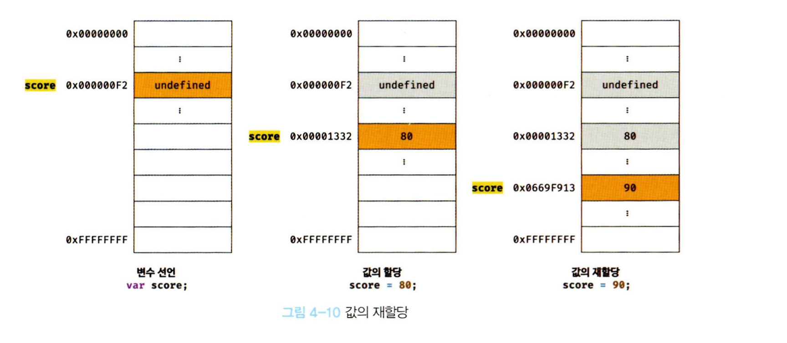
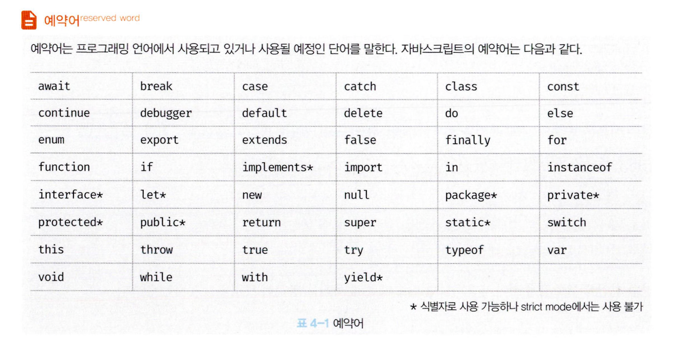

# 들어가기 앞서...

- 책에서는 `var` 사용 비중이 매우 커서 킹받는다.
- 그렇지만 다들 아는 내용이니 크게 신경쓰지는 않을게요.

# 4.5 값의 할당

- 변수에 값을 할당 할때에는 할당 연산자 `=`을 사용한다.
- 할당 연산자는 우변의 값을 좌변의 변수에 할당한다.

```javascript
var a;
a = 10;

var a = 10;
```

- 변수 선언과 값의 할당을 2개의 문으로 나누어 표현할 수도 있고 하나의 문으로 표현할 수도 있다.
- 이 둘의 차이는 값의 할당의 실행 시점이 다르다는 것이다.
- **변수 선언은 런타임 이전에 실행된다.**
- **값의 할당은 런타임에 실행된다.**

```javascript
console.log(a); // undefined
var a;
a = 10;
console.log(a); // 10

---

console.log(a); // undefined
var a = 10
console.log(a); // 10
```

- 변수에 값을 할당할때에는 undefined가 초기화되어 있던 메모리 공간에 새로운 값을 저장하는것이 아니다.
- 새로운 메모리 공간을 확보하고 그곳에 새로운 값을 저장한다.

# 4.6 값의 재할당

- 재할당이란 이미 값이 할당되어 있는 변수에 새로운 값을 또다시 할당하는 것을 말한다.

```javascript
var a = 0;
a = 10;
```

- `var` 키워드로 선언한 변수는 값을 재할당 할 수 있다.
- `var` 는 선언과 동시에 undefined로 초기화되기 때문에 처음에 변수에 값을 할당하는것도 재할당으로 봐야한다.
- 재할당이 불가능한 값은 변수가 아니라 `상수`라고 부른다 (const)

- 재할당 또한 기존 메모리 공간에 값만 바꾸는것이 아니라 새로운 메모리 공간을 확보하는 것이다.
  
- 사용되지 않는 값들은 GC (가비지 컬렉터)에 의해 메모리에서 자동 해제된다.

# 4.7 식별자 네이밍 규칙

- 식별자는 어떤 값을 구별해서 식별해낼 수 있는 고유한 이름이다.
- 식별자는 다음 네이밍 규칙을 준수해야 한다.

  - 식별자는 특수문자를 제외한 문자, 숫자, 언더스코어(\_), 달러 기호($)를 포함할 수 있다.
  - 단, 식별자는 숫자로 시작하는 것은 허용하지 않는다.
  - 예약어는 식별자로 사용할 수 없다



- 변수명 또한 식별자이기 때문에 위 네이밍 규칙을 따라야 한다.
- 참고로 변수는 쉼표로 구분해 하나의 문에서 여러 개를 한번에 선언할 수 있다.

```javascript
var a, b, c, d, e; // 가독성이 떨어져서 권장하진 않는다.
```

- ES5부터 한글이나 일본어 식별자도 사용할 수 있다. 하지만 별로 권장하진 않는다.
  - (fyi) 유니코드라 메모리 공간도 알파벳보다 더 많이 잡아먹는다.
- JS는 대소문자를 구별한다.
- 변수명은 의미를 명확하게 표현해야 한다. (닌자코드 금지!)
- 네이밍 컨벤션은 하나 이상의 영어 단어로 구성된 식별자를 만들 때 가독성 좋게 단어를 한눈에 구분하기 위해 규정한 네이밍 규칙이다.
  - 카멜 케이스 `firstName`
  - 스네이크 케이스 `first_name`
  - 파스칼 케이스 `FirstName`
  - 헝가리언 케이스
  ```javascript
  var strFirstName; // type + identifier
  var $elem = document.getElementById("myId"); // DOM 노드
  var observable$ = fromEvent(document, "click"); // RxJS 옵저버블
  ```
- 일관성만 유지된다면 어떤걸 써도 크게 상관은 없다.
- 하지만 일반적으로 변수명에는 카멜 케이스를, 생성자 함수나 클래스의 이름에는 파스칼 케이스를 사용한다.
