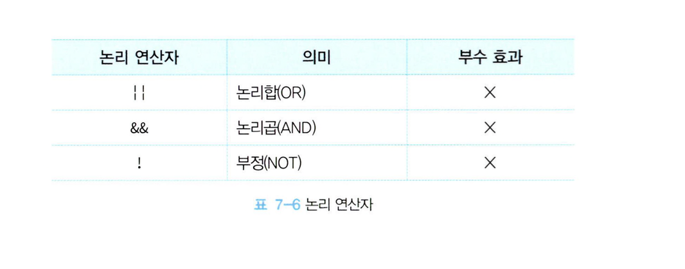
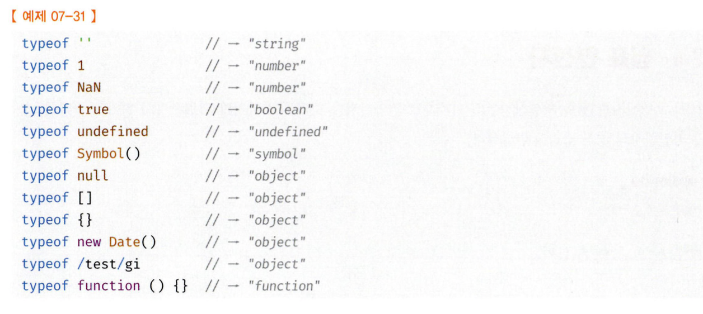
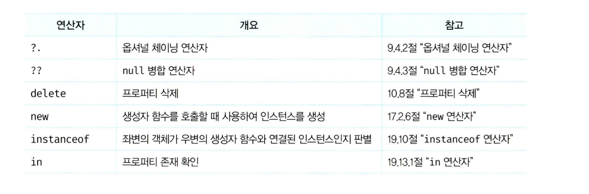
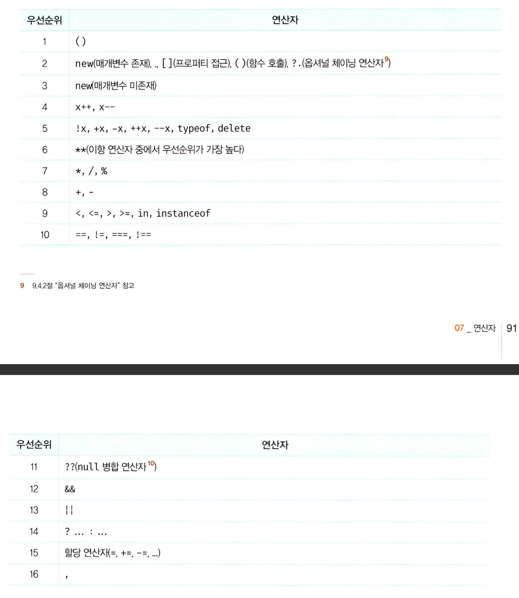
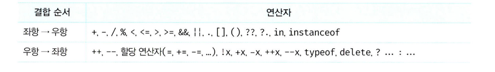

# 7.4 삼항 조건 연산자

- 삼항 조건 연산자는 조건식의 평가 결과에 따라 반환할 값을 결정한다.
- JS의 유일한 삼항 연산자이며 부수 효과는 없다.

```javascript
const result = score >= 60 ? "pass" : "fail";
```

- 삼항 조건 연산자의 피연산자가 조건식이므로 삼항 조건 연산자 표현식은 조건문이다.
- 따라서 `if else`로도 유사하게 사용 가능하다.

```javascript
let result;

if (score >= 60) {
  result = "pass";
} else {
  result = "fail";
}
```

- 이 둘의 차이는 삼항 조건 연산자 표현식은 값처럼 사용할 수 있지만, if else는 값처럼 사용할 수 없다는 것이다.
- **삼항 조건 연산자 표현식은 값으로 평가할 수 있는 표현식인 문이다.**

# 7.5 논리 연산자

- 논리 연산자는 우항과 좌항의 피연산자를 논리 연산한다.
  
- 논리 부정 연산자 (`!`)는 언제나 불리언 값을 반환한다. 단, 피연산자가 불리언일 필요는 없다.
- 피연산자가 불리언 값이 아니면 불리언 타입으로 암묵적 타입 변환된다.

```javascript
!0; // -> true
!"hello"; // -> false
```

- 논리합(`||`) 또는 논리곱(`&&`) 연산자 표현식의 평가 결과는 불리언 값이 아닐 수도 있다.
- 이 둘 연산자 표현식은 언제나 2개의 피연산자 중 한쪽으로 평가된다.

```javascript
"Cat" && "Dog"; // -> Dog
```

# 7.6 쉼표 연산자

- 쉼표 연산자는 왼쪽부터 차례대로 피연산자를 평가하고 마지막 피연산자의 평가가 끝나면 마지막 피연산자의 평가 결과를 반환한다.

```javascript
let x, y, z;
(x = 1), (y = 2), (z = 3); // 3
```

# 7.7 그룹 연산자

- 그룹 연산자는 소괄호로 피연산자를 감싸면 감싸져있는거 먼저 평가한다. (우선순위 조절을 위해 사용)

```javascript
10 * 2 + 3; // 23
10 * (2 + 3); // 50
```

# 7.8 typeof 연산자

- `typeof` 연산자는 피연산자의 타입을 문자열로 반환한다.
- `"string"`, `"number"`, `"boolean"`, `"undefined"`, `"symbol"`, `"object"`, `"function"` 중 하나가 반환된다.
  
- null은 타입이 아니라 값이다 그래서 typeof 연산을 해도 null이 아닌 "object"가 반환된다.
- null인지 확인하려면 `===` 쓰자.
- 선언하지 않은 식별자에 typeof를 쓰면 ReferenceError가 아니라 "undefined"가 반환된다.

# 7.9 지수 연산자

- 지수 연산자는 거듭제곱을 위해 사용된다.
- `Math.pow`로 대체 가능하다
- 음수를 거듭제곱 하려면 괄호로 묶어야 한다.

```javascript
2 ** 2; // 4
2 ** 0; // 1
2 ** 5; // 32
(-5) ** 2; // 25
```

# 7.10 그 외의 연산자



# 7.11 연산자의 사이드 이펙트

- 대부분의 연산자는 다른 코드에 영향을 주지 않는다. (사이드 이펙트가 없다.)
- 예를 들어 `1 * 2`는 다른 코드에 영향을 주지 않고 그저 2를 반환한다.
- `delete`나 `++` `--`같은 연산자는 숫자를 증감하거나 객체의 필드를 삭제하는 등의 부수효과를 일으킨다.
- 할당 연산자도 이미 선언된 변수의 값을 변경하는 부수효과를 일으킨다.

# 7.12 연산자의 우선순위



# 7.13 연산자의 결합 순서

- 연산자의 결합 순서란 연산자의 좌항 우항 중 어디부터 평가할 것인지를 나타내는 순서를 말한다.


