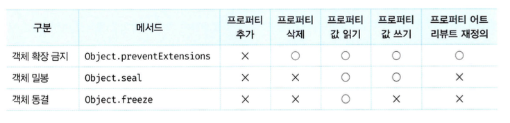

## 16.5 - 17.1

# 객체 변경 방지

- 객체는 변경 가능한 값이므로 재할당 없이 직접 변경할 수 있다.
- 자바스크립트는 객체의 변경을 방지하는 다양한 메서드를 제공한다.
- 이 메서드들은 객체의 변경을 금지하는 강도가 다르다.
  

## 객체 확장 금지

- `Object.preventExtensions` 메서드는 객체의 확장을 금지한다.
- 해당 메서드가 적용된 객체는 프로퍼티 추가가 금지된다.
- 프로퍼티는 동적 추가와 `Object.defineProperty` 메서드로 추가할 수 있다. 이 둘 다 금지된다.
- 확장이 가능한 객체인지 여부는 `Object.isExtensible` 메서드로 확인할 수 있다.

```javascript
const person = { name: "Lee" };

console.log(Object.isExtensible(person)); // true

Object.preventExtensions(person);

console.log(Object.isExtensible(person)); // false

person.age = 20;
console.log(person); // { name: "Lee" }

// 확장은 안되도 삭제는 가능하다.
delete person.name;
console.log(person); // {}
```

## 객체 밀봉

- `Object.seal` 메서드는 객체를 밀봉한다.
- 객체 밀봉이란 프로피티 추가 및 삭제와 프로퍼티 어트리뷰트 재정의 금지를 의미한다.
- 즉 `밀봉된 객체는 읽기와 쓰기만 가능하다.`
- 밀봉된 객체인지 여부는 `Object.isSeal` 메서드로 확인할 수 있다.

```javascript
const person = { name: "Lee" };

console.log(Object.isSeal(person)); // false

Object.seal(person);

console.log(Object.isSeal(person)); // true

console.log(Object.getOwnPropertyDescriptors(person));
/**
 * {
 *    name: { value: "Lee", writable: true, enumerable: true, configurable: false }
 * }
 */

person.age = 20;
console.log(person); // { name: "Lee" }

delete person.name;
console.log(person); // { name: "Lee" }

person.name = "Kim";
console.log(person); // { name: "Kim" }

// 프로퍼티 어트리뷰트 재정의가 금지된다
Object.defineProperty(person, "name", { configurable: true });
// TypeError: Cannot redefine property: name
```

## 객체 동결

- `Object.freeze` 메서드는 객체를 동결한다.
- 객체 동결이란 프로퍼티 추가 및 삭제와 프로퍼티 어트리뷰트 재정의 금지, 프로퍼티 값 갱신 금지를 의미한다.
- 즉, 동결된 객체는 readonly이다.
- 동결된 객체인지 여부는 `Object.isFrozen` 메서드로 확인할 수 있다.

```javascript
const person = { name: "Lee" };

console.log(Object.isFrozen(person)); // false

Object.freeze(person);

console.log(Object.isFrozen(person)); // true

console.log(Object.getOwnPropertyDescriptors(person));
/**
 * {
 *    name: { value: "Lee", writable: false, enumerable: true, configurable: false }
 * }
 */

person.age = 20;
console.log(person); // { name: "Lee" }

delete person.name;
console.log(person); // { name: "Lee" }

person.name = "Kim";
console.log(person); // { name: "Lee" }

// 프로퍼티 어트리뷰트 재정의가 금지된다
Object.defineProperty(person, "name", { configurable: true });
// TypeError: Cannot redefine property: name
```

## 불변 객체

- 지금까지 살펴본 변경 방지 메서드들은 얕은 변경 방지로 직속 프로퍼티만 변경이 방지되고 중첩 객체까지는 영향을 주지는 못한다.
- 따라서 `Object.freeze` 메서드로 객체를 동결하여도 중첩 객체까지 동결할 수는 없다.

```javascript
const person = {
    name: 'Lee',
    address: { city: 'Seoul1' }
};
// 얕은 객체 동결
Object.freeze(person);

// 직속 프로퍼티만 동결한다
console.log(Object.isFrozen(person)); // true

// 중첩 객체까지 동결하지 못한다
console.log(Object.isFrozen(person.address))； // false

person.address.city = 'Busan';
console.log(person); // {name: "Lee”f address: {city: "Busan"}}
```

- 객체의 중첩 객체까지 동결하여 변경이 불가능한 읽기 전용의 불변 객체를 구현하기 위해서는
  객체 타입의 모든 프로퍼티에 대해 재귀적으로 `Object.freeze` 메서드를 호출해야 한다.

```javascript
function deepFreeze(target) {
  // 객체가 아니거나 동결된 객체는 무시하고 객체이고 동결되지 않은 객체만 동결한다\
  if (target && typeof target === "object" && !Object.isFrozen(target)) {
    Object.freeze(target);
    Object.keys(target).forEach((key) => deepFreeze(target[key]));
  }
  return target;
}

const person = {
  name: "Lee",
  address: { city: "Seoul" },
};

// 깊은 객체 동결
deepFreeze(person);

console.log(Object.isFrozen(person)); // true
// 중첩 객체까지 동결한다
console.log(Object.isFrozen(person.address)); // true

person.address.city = "Busan";
console.log(person); // {name: "Lee", address: {city: "Seoul"}}
```
