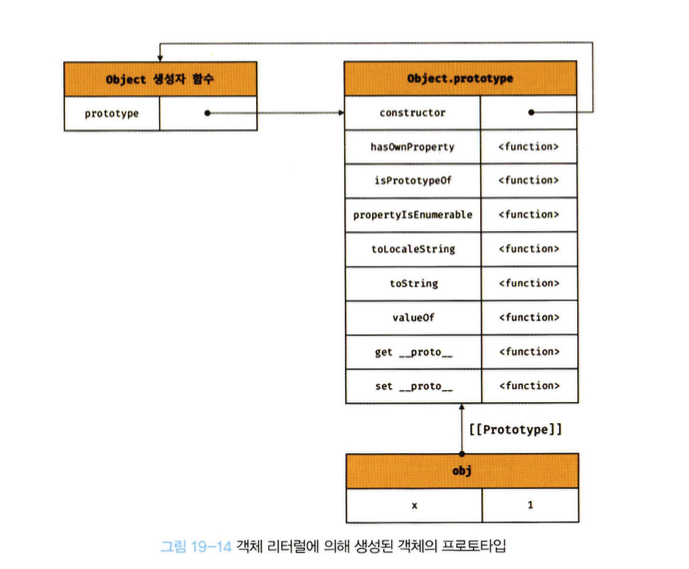
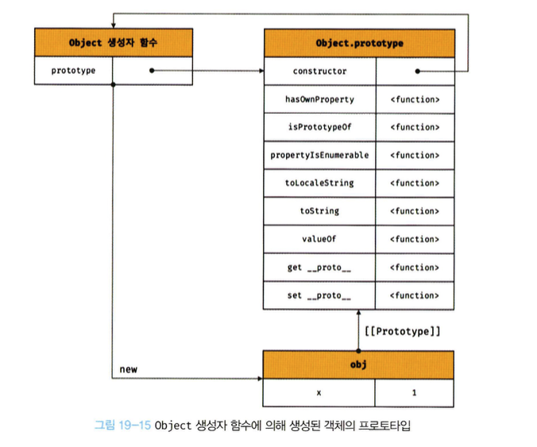
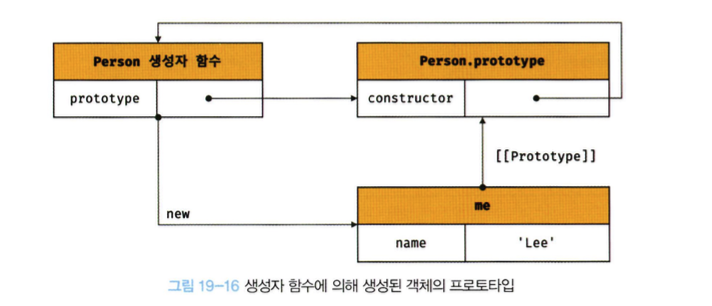
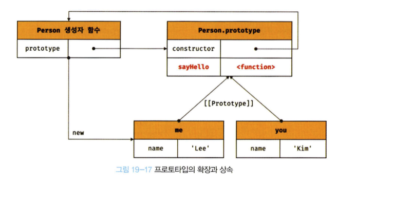
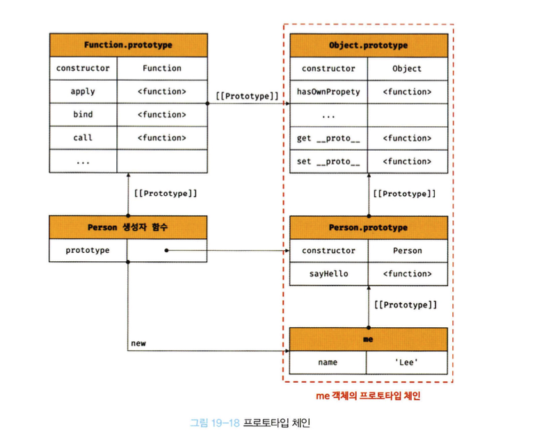

# 19.6 객체 생성 방식과 프로토타입의 결정

- 객체는 다음과 같이 다양한 생성 방법이 있다.
  - 객체 리터럴
  - Object 생성자 함수
  - 생성자 함수
  - Object.create 메서드
  - 클래스 (ES6)
- 이들 방식은 세부적인 생성 방식의 차이는 있으나 추상 연산 `OrdinaryObjectCreate`에 의해 생성된다는 공통점이 있다.
- 추상 연산 `OrdinaryObjectCreate`는 필수적으로 자신이 생성할 객체의 프로토타입을 인수로 전달 받는다. (객체의 프로퍼티 목록도 옵션으로 전달할 수 있다.)
- 추상 연산 `OrdinaryObjectCreate`는 빈 객체를 생성한 후, 객체에 추가할 프로퍼티 목록이 인수로 전달된 경우 프로퍼티를 객체에 추가한다.
- 그리고 인수로 전달받은 프로토타입을 자신이 생성한 객체의 `[[Prototype]]` 내부 슬롯에 할당한 다음 생성한 객체를 반환한다.
- 즉, 프로토타입은 `OrdinaryObjectCreate`에 전달되는 인수에 의해 결정된다.

## 19.6.1 객체 리터럴에 의해 생성된 객체의 프로토타입

- 자바스크립트 엔진은 객체 리터럴을 평가하여 객체를 생성할 때 추상 연산 `OrdinaryObjectCreate`를 호출한다.
- 이때 `OrdinaryObjectCreate`에 전달되는 프로토타입은 `Object.prototype`이다.

```javascript
const obj = { x: 1 };
```

- 위 객체 리터럴이 평가되면 `OrdinaryObjectCreate`에 의해 다음과 같이 Object 생성자 함수와 `Object.prototype`과 생성된 객체 사이에 연결이 만들어진다.
  
- 이처럼 객체 리터럴에 의해 생성된 obj 객체는 `Object.prototype`을 프로토타입으로 갖게 되며, 이로써 `Object.prototype`을 상속받는다.

## 19.6.2 Object 생성자 함수에 의해 생성된 객체의 프로토타입

- Object 생성자 함수를 인수 없이 호출하면 빈 객체가 생성된다.
- Object 생성자 함수를 호출하면 객체 리터럴과 마찬가지로 `OrdinaryObjectCreate`가 호출된다.
- 이때 `OrdinaryObjectCreate`에 전달되는 프로토타입은 `Object.prototype`이다.

```javascript
const obj = new Object();
obx.x = 1;
```

- 위 코드가 실행되면 `OrdinaryObjectCreate`에 의해 다음과 같이 Object 생성자 함수와 `Object.prototype`과 생성된 객체 사이에 연결이 만들어진다.
- 객체 리터럴에 의해 생성된 객체와 동일한 구조이다.
  
- 이처럼 생성자 함수에 의해 생성된 obj 객체는 `Object.prototype`을 프로토타입으로 갖게 되며, 이로써 `Object.prototype`을 상속받는다.
- 객체 리터럴은 객체 리터럴 내부에 프로퍼티를 추가하지만, 생성자 함수 방식은 빈 객체 생성 이후 프로퍼티를 추가한다는 차이가 있다.

## 19.6.3 생성자 함수에 의해 생성된 객체의 프로토타입

- new 연산자와 함께 생성자 함수를 호출하여 인스턴스를 생성하면 다른 객체 생성 방식과 마찬가지로 `OrdinaryObjectCreate`가 호출된다.
- 이때 `OrdinaryObjectCreate`에 전달되는 프로토타입은 생성자 함수의 prototype에 바인딩되어 있는 객체이다.

```javascript
function Person(name) {
  this.name = name;
}

const me = new Person("민순기");
```

- 위 코드가 실행되면 `OrdinaryObjectCreate`에 의해 다음과 같이 생성자 함수와 생성자 함수의 prototype 프로퍼티에 바인딩되어있는 객체와 생성된 객체 사이에 연결이 만들어진다.
  
- 표준 빌트인 객체인 Object 생성자 함수와 더불어 생성된 프로토타입 `Object.prototype`은 다양한 빌트인 메서드를 갖고 있다.
- 하지만 사용자 정의 생성자 함수와 더불어 생성된 프로토타입 `Person.prototype`의 프로퍼티는 constructor 뿐이다.
- 프로토타입 `Person.prototype`에 프로퍼티를 추가해서 자식 객체가 상속받을 수 있다.

```javascript
function Person(name) {
  this.name = name;
}

Person.prototype.sayHello = function () {
  console.log(`Hi My name is ${this.name}`);
};

const me = new Person("민순기");
const you = new Person("이소윤");

me.sayHello(); // Hi My name is 민순기
you.sayHello(); // Hi My name is 이소윤
```

- Person 생성자 함수를 통해 생성된 모든 객체는 프로토타입에 추가된 sayHello 메서드를 상속받아 자신의 메서드처럼 사용할 수 있다.
  

# 19.7 프로토타입 체인

```javascript
function Person(name) {
  this.name = name;
}

Person.prototype.sayHello = function () {
  console.log(`Hi My name is ${this.name}`);
};

const me = new Person("민순기");

console.log(me.hasOwnProperty("name")); // true
```

- Person 생성자 함수에 의해 생성된 me 객체는 `Object.prototype`의 메서드인 `hasOwnProperty`를 호출할 수 있다.
- 이것은 me 객체가 `Person.prototype`뿐만 아니라 `Object.prototype`또한 상속받았다는 것을 의미한다.

```javascript
Object.getPrototypeOf(me) === Person.prototype; // true
```

- `Person.prototype`의 프로토타입은 `Object.prototype`이다. 즉, 프로토타입의 프로토타입은 언제나 `Object.prototype`이다.

```javascript
Object.getPrototypeOf(Person.prototype) === Object.prototype; // true
```

- 즉 위 예제를 그림으로 표현하면 이렇다.
  
- 자바스크립트는 객체의 프로퍼티에 접근하려고 할 때 해당 객체에 접근하려는 프로퍼티가 없다면
  `[[Prototype]]` 내부 슬롯의 참조를 따라 자신의 부모 역할을 하는 프로토타입의 프로퍼티를 순차적으로 검색한다.
- 이를 프로토타입 체인이라고 한다. 프로토타입 체인은 자바스크립트가 상속을 구현하는 매커니즘이다.
- 프로토타입 체인의 최상위에 위치하는 객체는 언제나 `Object.prototype`이다.
  따라서 모든 객체는 `Object.prototype`를 상속받는다. `Object.prototype`를 프로토타입 체인의 종점이라고 한다.
- `Object.prototype`의 프로토타입인 `[[Prototype]]` 내부 슬롯의 값은 `null`이다.
- `Object.prototype`에서도 프로퍼티를 검색할 수 없다면 undefined를 반환한다.

- 이처럼 자바스크립트 엔진은 프로토타입 체인을 따라 프로퍼티와 메서드를 검색한다.
- 즉, **프로토타입 체인은 상속과 프로퍼티 검색을 위한 매커니즘이라고 할 수 있다.**

- 이에 반해 프로퍼티가 아닌 식별자는 스코프 체인에서 검색한다. 따라서 **스코프 체인은 식별자 검색을 위한 매커니즘**이라고 할 수 있다.

```javascript
me.hasOwnProperty("name");
```

- 위 예제의 경우 먼저 스코프 체인에서 me 식별자를 검색한다. me 식별자를 검색한 다음 me 객체의 프로토타입 체인에서 hasOwnProperty 메서드를 검색한다.
- **이처럼 스코프 체인과 프로토타입 체인은 서로 연관없이 별도로 동작하는 것이 아니라 서로 협력하여 식별자와 프로퍼티를 검색하는데 사용된다.**
